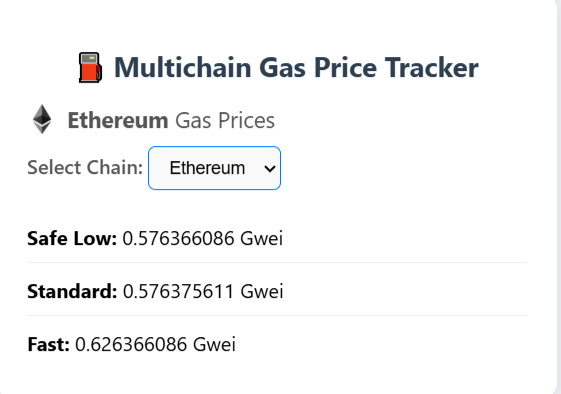

# ⛽ Multichain Gas Price Tracker

A simple React-based web app to view real-time gas prices across multiple blockchain networks like Ethereum, Polygon, and Binance Smart Chain using the Etherscan V2 API.

---

### 🎯 Objective & Purpose of the Project

The **Multichain Gas Price Tracker** is a web-based tool developed using **React** and **Etherscan’s Multichain API**, designed to provide real-time gas fee data across multiple EVM-compatible networks, including **Ethereum (Mainnet)**, **Polygon**, and **Binance Smart Chain (BSC)**.

#### 📌 Core Objectives

-  Fetch and display **live gas prices** (Safe, Proposed, and Fast rates) from selected blockchains using **Etherscan’s V2 API**.
-  Provide a chain-selectable interface to fetch and view real-time gas fees
-  Assist **developers, dApp users, and educators** in making cost-efficient and informed transaction decisions based on current network congestion and fee trends.

### ✅ Gas Price Tiers

Gas prices on Ethereum and other EVM-based blockchains vary depending on network congestion. This tracker displays three main tiers:

- **🟢 SafeGasPrice** – Lowest cost, but transactions may be slower to confirm.
- **🟡 ProposeGasPrice** – Standard market rate offering a good balance of cost and speed.
- **🔴 FastGasPrice** – Highest fee for priority processing and faster confirmations.


#### 🧑‍💻 Target Audience

- **Web3 developers** needing accurate fee estimates for contract deployment or interaction.
- **Crypto users** who want to time transactions during lower congestion periods.
- **Educators and blockchain learners** aiming to understand network mechanics and fee structures across chains.

---

## 🚀 Features

- 🔁 Auto-refreshes gas data every 60 seconds
- 🌐 Supports multiple chains (Ethereum, Polygon, BSC)
- 🧭 Easy-to-use dropdown for chain selection
- 💡 Clean and responsive UI
- 🔐 Uses `.env` for secure API key management

---

## 🖼️ Screenshots



---

## 📦 Tech Stack

- **Frontend**: React
- **Data Source**: Etherscan V2 Multichain API
- **Styling**: CSS

---

## 📁 Project Structure

```bash

multichain-gas-tracker/
├── public/
│ └── Logos/
│ ├── ethereum.png               # Ethereum logo image
│ ├── polygon.png                # Polygon logo image
│ └── bsc.png                    # Binance Smart Chain logo image
│
├── src/
│ ├── GasTracker.js              # React component for fetching and displaying gas prices
│ ├── style.css                  # CSS styles for GasTracker component
│ └── App.js                     # Main App component that renders GasTracker
│
├── .env                         # Stores API key
├── .gitignore                   # Specifies files/folders to ignore in Git
├── README.md                    # Project documentation
├── package.json                 # Project metadata and dependencies
```

## 📦 Installation & Setup

### 1. Clone the Repository

```bash
git clone https://github.com/Rumpa-Dey/Multichain-Gas-Price-Tracker.git
cd Multichain-Gas-Price-Tracker
```
### 2. Install Dependencies

```bash
npm install
```
### 3. Configure the API Key

Create a `.env` file in the **root directory** of your project and add your Etherscan API key as shown below:

```env
REACT_APP_ETHERSCAN_API_KEY=your_api_key_here
```
🧪 You can get a free API key from [Etherscan.io](https://etherscan.io/myapikey)

✅ This single key works for Ethereum, Polygon, and BSC (via Etherscan Multichain API support).

### 4. Start the App
```bash
npm start
```
The app will run locally at http://localhost:3000.


## 🌐 Supported Networks

| Chain     | Chain ID |
|-----------|----------|
| Ethereum  | 1        |
| Polygon   | 137      |
| BSC       | 56       |


## 🤝 Contributing

Pull requests are welcome. For major changes, open an issue first to discuss what you would like to change.


## 📄 License

This project is licensed under the MIT License.

## 🙋‍♀️ Author
Made by Rumpa Dey