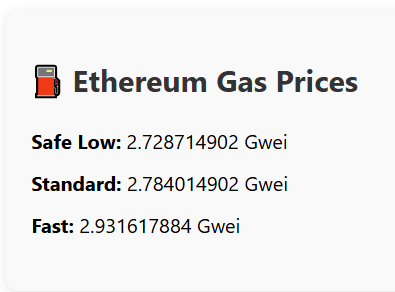

# ⛽ Ethereum Gas Tracker

A lightweight React app that displays real-time Ethereum gas prices using the [Etherscan Gas Oracle API](https://docs.etherscan.io/api-endpoints/gas-tracker). Ideal for Ethereum developers and enthusiasts looking to monitor gas prices before making transactions.

---

---

## 🚀 Features

- ⚡ Real-time Ethereum gas price updates every 60 seconds
- 📊 Shows Safe Low, Standard, and Fast prices (in Gwei)
- 🖥️ Built with React and Axios
- 🔐 Secured with environment variables for API key
- 🎨 Clean and responsive UI

---

## 📸 Screenshots

### 📊 Etherium Gas Prices


## 🛠️ Tech Stack

- **React** (Frontend)
- **Axios** (API requests)
- **CSS** (Styling)
- **Etherscan API** (Live gas data)

---

## 📦 Installation & Setup

### 1. Clone the Repository

```bash
git clone https://github.com/Rumpa-Dey/ethereum-gas-tracker.git
cd ethereum-gas-tracker
```
### 2. Install Dependencies

```bash
npm install
```
### 3.Configure the API Key

Create a file named `.env` in the root directory, and add your Etherscan API key:

```env
REACT_APP_ETHERSCAN_API_KEY=your_api_key_here
```
🧪 You can get a free API key from [Etherscan.io](https://etherscan.io/myapikey)

### 4. Start the App
```bash
npm start
```
The app will run locally at http://localhost:3000.

## 🌐 API Reference

This project uses the [Etherscan Gas Oracle API](https://docs.etherscan.io/api-endpoints/gas-tracker) to fetch:

- SafeGasPrice – Lower-cost transaction fees (slower)

- ProposeGasPrice – Standard gas price (moderate speed)

- FastGasPrice – Higher fee for faster confirmation

## 🗂️ Project Structure

```bash
ethereum-gas-tracker/
├── public/
├── src/
│   ├── GasTracker.js       # Main component
│   ├── style.css           # Styles for UI
│   └── App.js              # App entry point
├── .env                    # (ignored) Stores API key
├── .env.example            # Template for others
├── .gitignore              # Files to exclude from Git
├── package.json
└── README.md
```
## 📄 License

This project is licensed under the MIT License.

## 🙏 Acknowledgements

[Etherscan API](https://docs.etherscan.io/)

[React Docs](https://react.dev/)